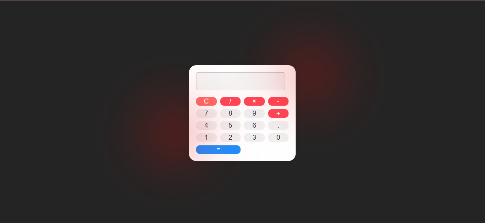

# 🧮 Calculadora React - Projeto Personalizado

Este é um projeto de calculadora desenvolvido com **React**, inspirado no curso da [DIO (Digital Innovation One)](https://www.dio.me/), mas com uma **abordagem totalmente personalizada**.  
Preferi criar do meu jeito, com uma estrutura mais limpa, moderna e uma **interface muito mais bonita** e responsiva 💅✨



## 🔥 Diferenciais em relação ao projeto original da DIO

- 🎨 **Estilo próprio** com design aprimorado
- ⚛️ Estrutura de componentes mais organizada
- 📱 Totalmente responsiva
- 🧠 Lógica de funcionamento clara e eficiente
- 🧹 Código limpo e fácil de entender
- 💡 Uso inteligente de estados e eventos do React

## 🛠️ Tecnologias utilizadas

- React
- JavaScript (ES6+)
- CSS (ou styled-components, se você usou)
- Vite (se aplicável)

## 🐞 Um bug peculiar que enfrentei (e resolvi com estilo)

Normalmente não adiciono esse tipo de detalhe, mas esse bug foi tão curioso que vale o registro.

Durante o desenvolvimento, o CSS estava aparecendo na tela como texto visível, o que é bem incomum. Após investigar, descobri que o problema era causado por um conflito entre dois arquivos CSS.

A solução foi simples, mas esperta:
Copiei um trecho do texto que estava sendo exibido indevidamente na tela e pesquisei esse conteúdo dentro da minha IDE (VS Code). Isso me levou até o index.css, que estava conflitando com outro CSS importado no App.jsx.

Ao comparar os dois arquivos, identifiquei as irregularidades na declaração e importação de estilos e corrigi o conflito — deixando tudo funcionando perfeitamente e visualmente bonito como planejado.


## 🚀 Como executar o projeto

```bash
# Clone o repositório
git clone https://github.com/teuzowebdeveloper9/calculadora

# Acesse a pasta
cd calculadora

# Instale as dependências
npm install

# Execute o projeto
npm run dev
